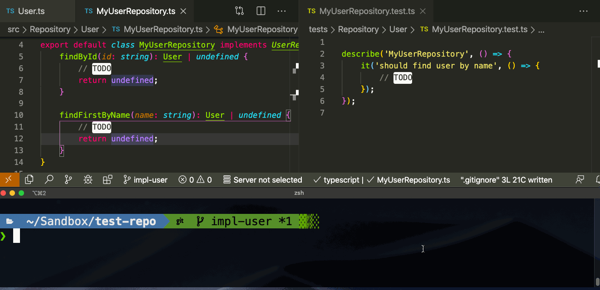
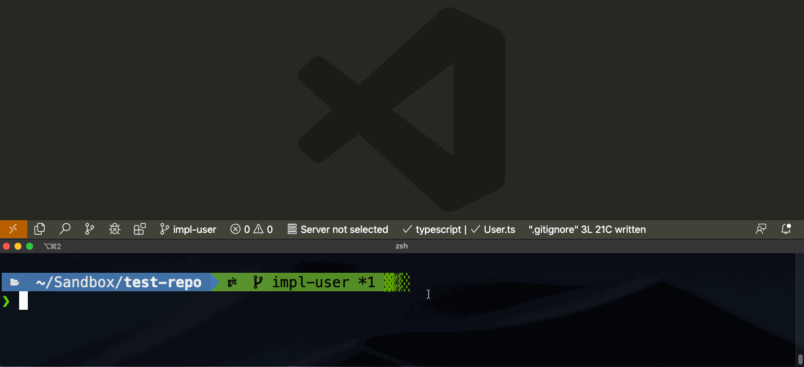
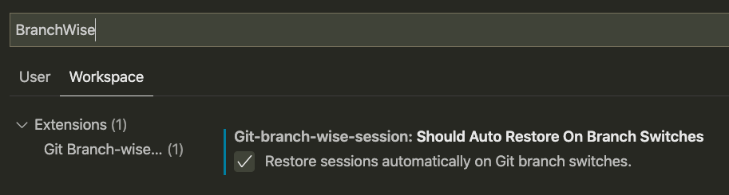

# Git Branch-wise Session

An Extension to keep Tabs for each Git branch.

## See It in Action

### Save and Restore Tabs on Git Branch Basis

You can manually save opened Tabs for current Git Branch, so that you can restore tabs when you switch back later.

### Restore Sessions Automatically on Git Branch Switches

The Extension automatically restores the saved Session for you whenever you switch to another Git Branch. If no saved sessions are available, the Extension simply ignores.

To enable this feature, you should configure `git-branch-wise-session.shouldAutoRestoreOnBranchSwitches` to `true`. See `Configurations`.

## How to Use

Start typing with `Ctrl + P` or `Cmd + P` → `> Git Branch-wise Session`

- Save Current Session: `Ctrl + P` / `Cmd + P` → Type `> Save Session for Current Branch`
- Restore Session for Current Branch: `Ctrl + P` / `Cmd + P` → Type `> Restore Saved Session for Current Branch`
- Clear Saved Session for Current Branch: `Ctrl + P` / `Cmd + P` → Type `> Clear Saved Session for Current Branch`
- Clear All Saved Session: `Ctrl + P` / `Cmd + P` → Type `> Clear All Saved Sessions`
- Configure Extension: `Ctrl + P` / `Cmd + P` → Type `> Open Settings` → Choose settings to configure.

## Prerequisites

- You **must** enable [`vscode.git`](vscode:extension/vscode.git) Extension beforehand.
  - This Extension is **one of VSCode builtin Extensions**, so you don't need to install this. You have already enabled it, unless you had disabled it.

## Install

Get it on [Git Branch-wise Session - Visual Studio Marketplace](https://marketplace.visualstudio.com/items?itemName=mangano-ito.git-branch-wise-session).

## Configurations

### `git-branch-wise-session.shouldAutoRestoreOnBranchSwitches`

- `type`: `boolean`
- `default`: `false`

You should enable this option to restore sessions automatically on Git branch switches.
